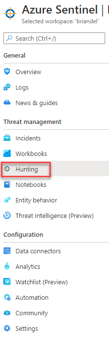
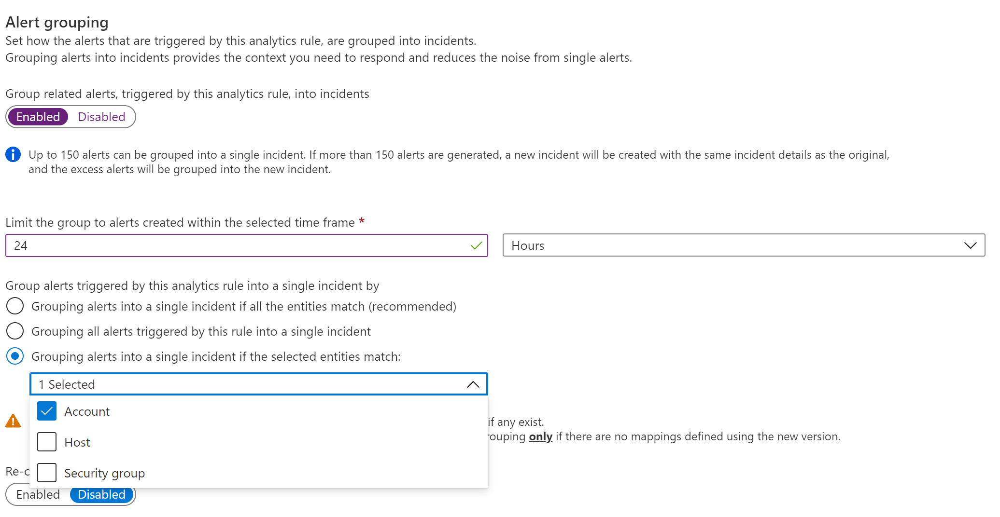
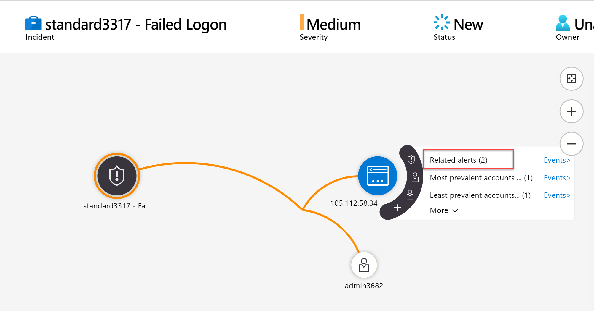
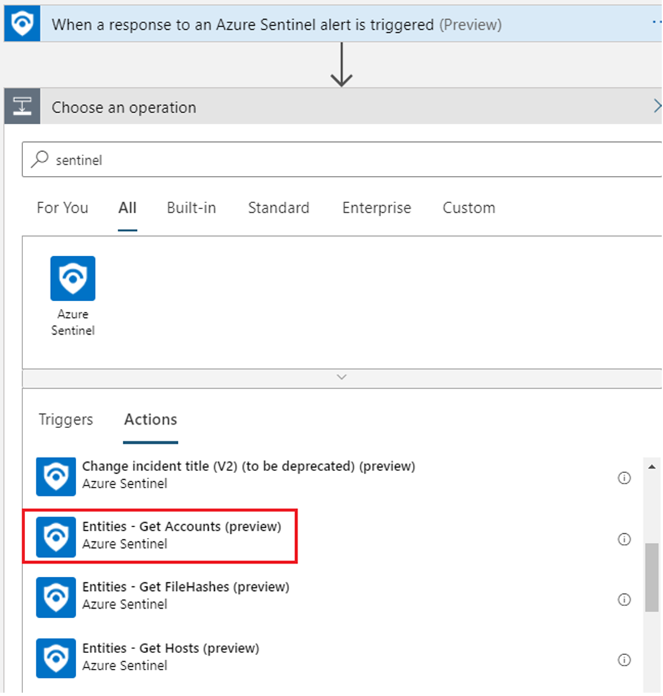

## Exercise 2: View Livestream, Setup Alerts (Analytics) and Respond to Incident in Azure Sentinel

In this section we will view events occuring live and then configure Alerts in Azure Sentinel to generate Incidents for our security team.  During the review of these Incident we will build a Playbook to simplify the handling of these alerts.<br>

## Task 1: Log on to the My Apps portal as a **Standard User**<br>

For example, if I was assigned number 47, my username would be **standard47@sentinellab.xyz**<br>

In this task you will logon to the My Apps portal as a standard user to confirm the accounts functionality.  Afterwards, you will send bad passwords to the account to simulate an unauthorized user attempting to gain access.

1. In a browser, navigate to https://myapps.microsoft.com
2. Enter the account information (**please notice that we are using the standard user on this step**):<br>
   Username: **standardXX@sentinellab.xyz** (where “XX” is the number you have been assigned at the start of class)<br>
   Password: **Provided by instructor**
3. Confirm you have access to the My Apps portal.
4. Close all instances of your browser and Navigate back to https://myapps.microsoft.com
5. This time, when logging on as **standardxx@sentinellab.xyz** type in an **incorrect password**
6. Repeat this invalid logon attempt **5 times**

## Task 2: Log on to Azure and Navigate to Sentinel<br>

In this task you will log into the Azure portal and navigate to Sentinel.

1. In a browser, navigate to https://portal.azure.com.
2. Enter the account information (**please notice that we are using the admin user on this step**):<br>
   Username: **AdminXX@sentinellab.xyz** (where “XX” is the number you have been assigned at the start of class):<br>
   Password: **Ask the trainer**
3. This brings you to the Azure Home. In the box at the top, search for **Sentinel**.
4. In the results, click on **Azure Sentinel**

<br><br>

5. Click **briandel**, which is the name of the Sentinel Workspace.

<br><br>

6. Within the navigation bar, click **Hunting**

``<br><br>

## Task 3: Create Hunting Rule for Failed Logon and add to Livestream<br>

In this task we create a new hunting rule, add this to the live stream results to review failed logons occuring in real time.

1. Click **+ New Query**<br>
2. In the Name box type **standardXX – Failed Logon** (where “XX” is the number you have been assigned at the start of class)<br>
3. Leave the **Description** box blank
4. In **Custom Query** copy the following query:

## Important!!!! **(INSIDE THE QUERY substitute “XX” with your assigned number)**

<br><br>

```powershell
SigninLogs
| where Status.errorCode == 50126 // Invalid Username or password
| where UserPrincipalName contains "standardXX"
| project TimeGenerated, Status.failureReason, UserPrincipalName, Status.errorCode, UserId, IPAddress 
| sort by TimeGenerated desc
```

1. Under Entity Mapping, map the following entities

   * Account -> UserprincipalName (Click **Add**)
   * IP -> IPAddress (Click **Add**)
2. At the bottom, click **Create**
3. In Queries, search for the query you have just saved. **standardXX – Failed Logon** (where “XX” is the number you have been assigned at the start of class)<br>
4. Select the **Run Query** button in the bottom right of the screen and confirm if we have results returned.  <br>
   **Note due to a known issue we can see error on result, please wait for a period of time and try to run query again**
5. Select the ellipsis button as the end of the query and select **Add to livestream**

<br>

10. In the Livestream tab search for your query **standardXX – Failed Logon** (where “XX” is the number you have been assigned at the start of class) and confirm your query in running and select  **open livestream** in the bottom right corner
11. In the window confirm the Livestream is still running and leave browser open
12. In a new browser navigate back to https://myapps.microsoft.com
13. When logging on as **standardxx@sentinellab.xyz** type in an **incorrect password**
14. Repeat this invalid logon attempt **5 times**
15. Return to the browser where Livestream is running and confirm we see results returned (this can take a few minutes).

## Task 4 Create Analytics Rule for Failed Logons<br>

1. In the Livestream browser windows already open click **Create anaytics rule**

<br>

2. Leave the Name as it was created and Description as blank
3. In Tactics select **Initial Access**
4. Set the Severity as **Medium** and Status to **Enabled**
5. Click **Next:Set Rule logic**
6. Leave the Rule query and the Map entities as they have already been set
7. In Query scheduling set **Run Query every** to **5 minutes** and Lookup date from the last to **30 minutes**
8. In Alert Threshold set Generate alert when number of query results **is greater than** to **0**
9. “Under Event grouping, leave it as **"Group all events into a single alert"**
10. Under Suppression, Set Stop running query after alert is generated after alert is generated to **On** and Stop running query for: **30 minutes**
11. At the bottom, click Next: **Incident settings**.
12. On Create incidents from alerts triggered by this analytics rule, set to **Enabled**.
13. Under Group related alert, triggered by this analytics rule, into incidents, set to **Enabled**.
14. Set Limit the group to alerts created within the selected time frame to **24 Hours**.
15. Under Group alerts triggered by this analytics rule into a single incident by, select the radio button for **Grouping alerts into a single incident if the selected entities match** and from the drop-down menu, select **Account.**

<br><br>

18. Set Re-open closed matching incidents to **Enabled**.
19. At the bottom, click **Next : Automated response.**
20. Do not change anything on the next screen and at the bottom click **Next: Review.**
21. Click **Create.**

## Task 5: Create Analytics Rule for Admin Group Change

1. Navigate back to the main Sentinel home screen and in the navigation bar select **Analytics**

<br><br>

2. Click **Create** and choose **Scheduled query rule** from the flyout menu (note the different options available)<br>
3. In the Name box **type AdminXX – Admin Group Change** (where “XX” is the number you have been assigned at the start of class)
4. Leave **Description** blank
5. For Tactics, choose **Persistence** and **Privilege Escalation**
6. Select Alert Severity **Medium**
7. Set Status to **Enabled.**
8. At the bottom, click **Next: Set rule logic.**
9. In Rule query copy the following query

```powershell
let accttypes = dynamic(['Domain Admins', 'Enterprise Admins', 'Schema Admins', 'Administrators', 'Account Operators', 'Backup Operators', 'Print Operators', 'Server Operators', 'Domain Controllers', 'Read-only Domain Controllers', 'Group Policy Creator Owners', 'Cryptographic Operators']);
SecurityEvent 
| where EventID in (4728, 4729, 4732, 4733, 4756, 4757)
| extend ChangeType = case(EventID in (4729, 4733, 4757), "Member Removed", "Member Added") 
| parse EventData with *'"TargetUserName">'TargetUserName'<'*
| where TargetUserName in (accttypes)
| project ChangeType, ImpactedGroup=TargetUserName, ImpactedGroupSid = TargetSid, ImpactedAccount=MemberName, ImpactedAccountSid = MemberSid, ChangeMaker=Account, DC=Computer
```

9. Under Entity Mapping, map the following entities (Select **+ Add new entity** for each one)<br>

    | Entity | Identifier | Value |
    | - | - | - |
    | Account | Sid | ImpactedAccountSid |
    | Host | FullName | DC |
    | Security group | SID | ImpactedGroupSid |
<br>

11. Set the Run query every to **30 minutes**
12. Set the Lookup data from the last to **1 hour**
13. Set the Alert Threshold to Generate alert when number of query results to **Is greater than** and the threshold to **0**
14. Under Event grouping, leave it as **“Group all events into a single alert"**
15. Under Suppression, Set Stop running query after alert is generated to **On** and Stop running query for: **8 hours**
16. At the bottom, click **Next: Incident settings.**
17. On Create incidents from alerts triggered by this analytics rule, set to **Enabled.**
18. Under Group related alert, triggered by this analytics rule, into incidents, set to **Enabled.**
19. Set Limit the group to alerts created within the selected time frame to **24 Hours.**
20. Under Group alerts triggered by this analytics rule into a single incident by, select the radio button for **Grouping alerts into a single incident if the selected entities match** and from the drop-down menu, select **Account.**

<br><br>

20. Set Re-open closed matching incidents to **Enabled.**
21. At the bottom, click **Next: Automated response.**
22. Leave the following page unchanged and click **Next: Review**
23. Click **Create**

## Task 6: Review your Incidents

1. Navigate back to **Incidents**
2. Locate your incident standard**XX** – Failed Logon (where “XX” is the number you have been assigned at the start of class)
3. Click your Incident. Then Click the **Investigate** button on the lower right-hand side
4. Within the Investigation window hover over the IP Address or user account node and select **Related Alerts** to bring in additional alert data associated to that IP address.<br>
   **Note**: Data will vary based on the other events occurring in the lab. The IP address will likely be different and the number of related alerts will depend on other users in the lab. This is how Investigation within Sentinel is intended to function.

<br><br>

5. You may explore other available options in the investigation graph. However, depending upon the data available at the time, some options in the graph will be grayed out.
6. Navigate back to Azure Sentinel -> Incidents and locate your incident **AdminXX – Admin Group Change**
7. Click on your incident and Click the **Investigate** button
8. Within the investigation window you can see the User that was added to the group, and the Group that they were added to.
9. Hover over the User account victim4 and click **Related alerts** to see additional alerts related to this Admin group change involving this account.

<br><br>

## Task 7 Review Entities within the Incident

In this section we will review the insights available when enabling User and Entity Behavior Analytics (UEBA).<br>

1. Navigate back to **Incidents**
2. Locate your incident standard**XX** – Failed Logon (where “XX” is the number you have been assigned at the start of class)
3. Click your Incident. Then Click the **view full details** button on the lower right-hand side
4. Under the details for the incident and Entities section on the right hand side click on your standard**XX** user entity
   
5. Review all the details we can see regarding your user Entity. The details will change depending in activity within the environment and other activities
6. Review the **Insights** on right hand side to see if we have any anamolous activity for the standard user and when this occurred.


7. Review the other area of the the Insight section including the **UEBA Insights**

## Task 8: Create a playbook to respond to your Incidents

In this playbook we will be adding a user into a group based on a Incidents.  This group is already linked to a conditional access policy which will block user logons to all cloud applications.

1. Navigate to **Sentinel -> Automation** in the Azure Portal.


2. Click the **Create** button.
3. Click **Add new playbook**
4. Under Resource Group, Select **OI-Default-East-US**
5. In the Logic App Name field, type standard**XX**-Block-With-Conditional-Access-Policy (where “XX” is the number you have been assigned)
6. Select Location **East US**
7. Leave Log Analytics and Associate with integration service enviornment turned  **Off**
8. Click **Review + Create**
9. On the next screen, click **Create.**
10. Wait for the Logic App to deploy.
11. On the Your Deployment is complete screen, click **Go to resource.**
12. In the Logic Apps Designer, Click **Blank Logic App**
13. In the text box **Search connectors and triggers** type **Sentinel** and click on the icon for **Azure Sentinel**.
14. Select **When a response to an Azure Sentinel alert is triggered**
15. Click **New Step**
16. Search for **Sentinel** and click on the **Azure Sentinel** icon
17. Click **Entities – Get accounts (preview)**.

<br><br>

17. Click the text box **Entities List** and from the layout, select **Entities**

<br><br>

18. Click **New Step** and search for and select **Control.**
19. Click on **For each**
20. In the **Select an output from previous steps** click in the text box and click **Accounts** in the flyout
21. Click **Add an action**
22. Search for and select **Azure AD**
23. Select **Get user**
24. Click in the **User Id or Principal Name** field
25. From the flyout click **Accounts Name**
26. Staying within the flyout, click **Expression.**
27. In the **fx** box type **string('@')** and click **Ok**

<br><br>

28. Staying within the flyout, click **Accounts UPN Suffix**
29. Next, click **Add an action**

<br><br>

30. Search for and click on Azure AD
31. Select **Add user to group**
32. Under Group ID, enter **4aa42844-7b1a-410f-b4eb-aacdc3e98b92**
33. Under User ID, select **Id** from the flyout

<br><br>

34. At the bottom of the page, click **New Step**
35. Search for Azure Sentinel and select **Alert – Get incident (preview)**
36. Click Specify Subscription Id and select **Subscription ID** in the flyout
37. Click Specify resource group and select **Resource group** from the flyout
38. Click Specify workspace id and select **Workspace ID** in the flyout
39. Click Specify alert id and select **System alert ID** in the flyout

<br><br>

40. Click New Step, search for Azure Sentinel and select **Add comment to incident (V3)**
41. Click Incident **ARM id and select Incident ARM ID** from the flyout
42. Click on the Incident comment field and type **"User was blocked with Conditional Access by Logic App"**

<br><br>

43. Click **Save**

## Task 9: Use your new playbook to respond to a Incidents

1. Navigate back to **Sentinel -> Incidents** in the Azure Portal
2. Click on your incident standard**XX** – Failed Logon
3. Click **View full details**
4. Under the Incident, click **View playbooks**

<br><br>

5. From the list of Playbooks locate **standardXX-Block-With-Conditional-Access-Policy** and click **Run**
6. Close all browser windows and open a new browser
7. Navigate to https://myapps.microsoft.com
8. Enter the account information:<br>
   Username: **standardXX@sentinellab.xyz** (where “XX” is the number you have been assigned at the start of class)<br>
   Password: **Ask the trainer**
9. You will now see that access to the my apps portal has been blocked due to conditional access

<br><br>

## Task 10: (Optional) Review Additional Logic Apps in Azure Sentinel GitHub

Navigate to Azure Sentinel official GitHub Repository into the playbook section https://github.com/Azure/Azure-Sentinel/tree/master/Playbooks <br> review the list of playbooks and the deployment options.

### Continue with the next lab

LAB 03 - Proactively Investigate Potential Threats, Misconfigurations, and Suspicious Activities Visually, click <a href="../LAB03/README.md" target="_blank">here</a>
