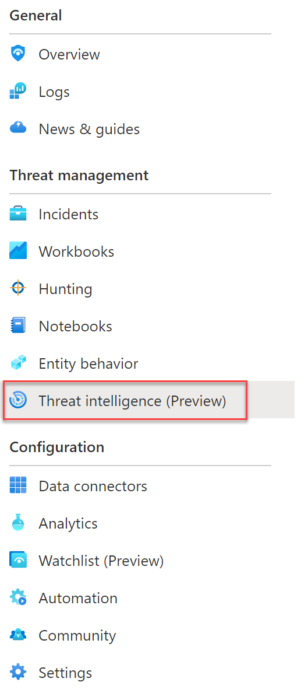

## Exercise 5: Using Threat Intelligence. <br>
In this lab we will manually import threat indicators into Sentinel which can be used to highlight potential threats or attacks into your environment. <br>

**Task 1:** Manually Create a Threat indicator <br>
In this task we will manualy add a threat indicator to  threat intelligence. You can also import threat intelligence and indicators from other external sources using data connectors.

1. Navigate to Sentinel and Select Threat Intelligence in the Taskbar

<br.>
<br>

  
2. Review how many Threat Indicators are currently imported. (Note we have many different sources of threat indicators that have been imported into this Sentinel workspace)

4. We are going to add our current public IP address as a threat for the purposes of the Lab. Please open a browser and use a site such as . http://whatismyip.host/ to find your IPv4 public address. 
5. In Threat Intelligence click add new 
6. In the "New Indicator" add **ipv4-addr** as the type.
7. Add your public IPv4 address record in steps 4 as the **IPv4 address**
8. In Threat Types select **benign** 
9. Leave Description blank and in Name **AdminXX-IPv4Threat** where **XX** is your student number
10. Set confidence to **100*
11. Select today's date in Valid from and set tomorrow's date for Valid until

 <br>
<br>

12. Click **Apply**

**Task 2** Review Threat Intelligence workbook

1. In the Threat intelligence section of Sentinel select the Threat intelligence workbook


  <br>
2. Review the various parts of the workbook. Note when TIs have been imported, what types of indicator we have and also the Alert counts we see associated with the TIs <br>
   
3. We might also see some alerts associated with IP addresses indicator in the **Alert counts by indicator" section now. These will be picking up alerts created by particpants in previous labs. <br>

**Task 2:** Create Hunting Query to link TIs with Signin <br> <br>
In this task we are linking the threat indicator we have created to the AAD signin logs. This would help mimic us detecing signins from a malicious IP we have added to our Threat indicators. <br>

1. Navigate to **Hunting** in the  Sentinel navigation bar <br>
2. Click **New Query** to create a custom query<br>
3. In Name **AdminXX Signin to TI IP Address** where **XX** is your student number.<br>
4. Leave Description blanks<br>
5. In Custom Query add the below query changing the **adminXX** to the student number assigned to use. Take note of the KQL joing the two tables

```powershell
SigninLogs
|project UserPrincipalName, Identity, IPAddress, ClientAppUsed, Status,AuthenticationDetails, TimeGenerated
| join (ThreatIntelligenceIndicator | project IPAddress = NetworkIP, Active, ThreatType) on IPAddress
| extend succeeded_ = tostring(parse_json(AuthenticationDetails)[0].succeeded)
|project TimeGenerated, UserPrincipalName,IPAddress,ThreatType, ActiveThreat= Active, LogonSucceed = succeeded_
|where UserPrincipalName contains "AdminXX"
```
6.	Under Entity Mapping, map the following entities<br>
o	Account -> UserPrincipalName  (Click **Add**)<br>
o	IP -> IPaddress (Click **Add**)<br>

7. Select **Initial Access**  in Tatics <br>
8. Click **Create** <br>
9. Search for and Run the query to confirm the results 


   