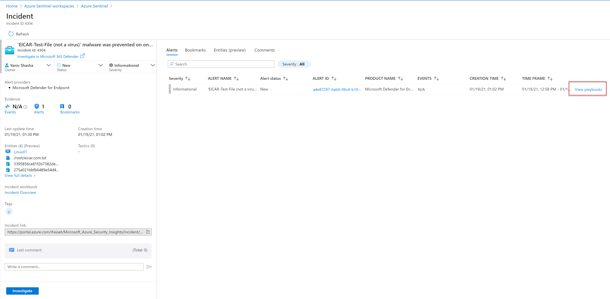
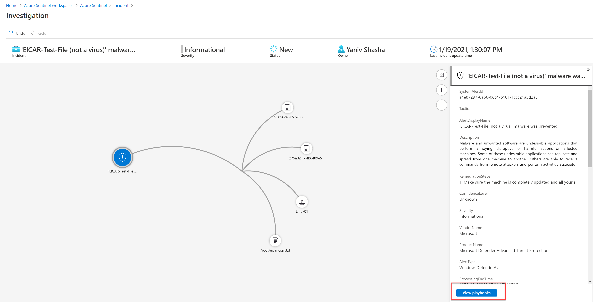
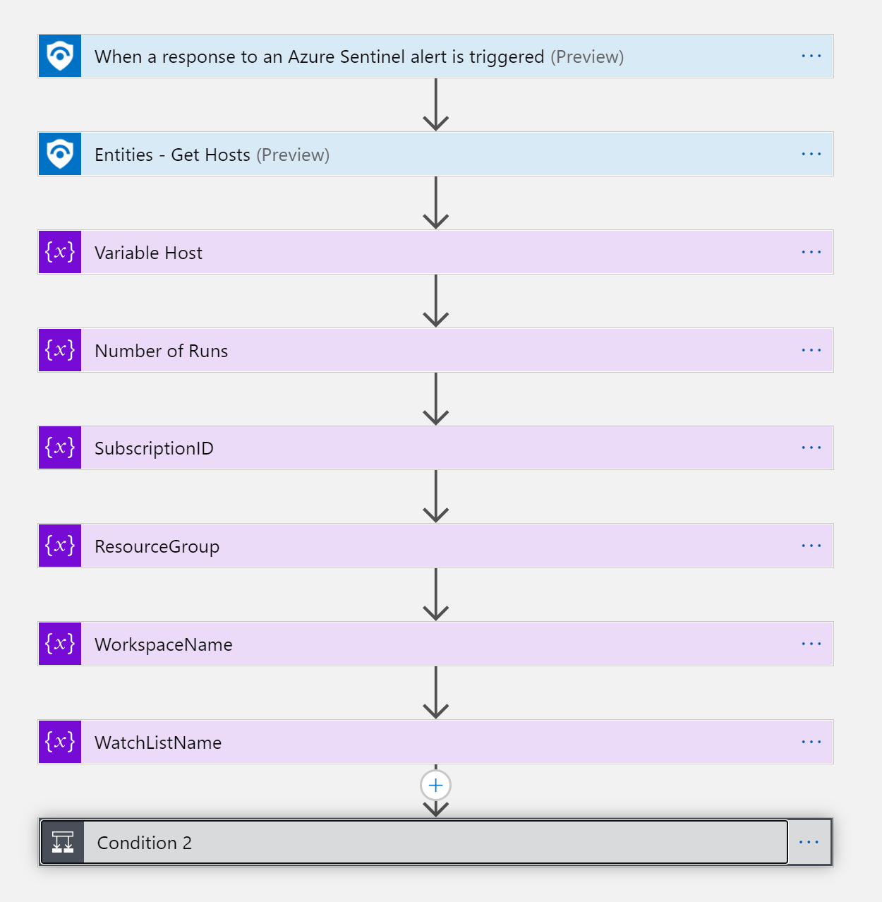
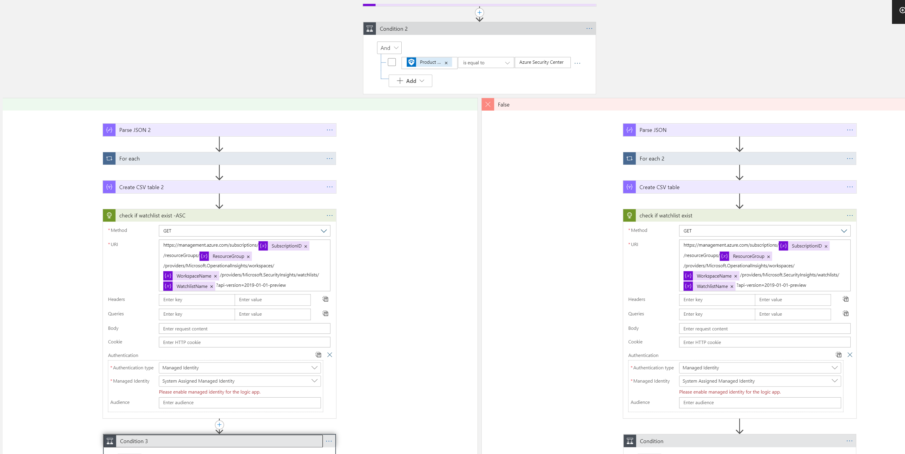

#  Watchlist-Add-HostToWatchList

Author: Yaniv Shasha

This playbook will add a Host entity to a new or existing watchlist.

 

## logical flow to use this playbook

	1. The analyst finished investigating an incident one of its findings is a suspicious Host entity.
	2. The analyst wants to enter this entity into a watchlist (can be from block list type or allowed list).
	3. This playbook will run as a manual trigger from the full incident blade or the investigation graph blade, or automatically.

 
  

**The playbook, available here and presented below, works as follows:**
1.	Manually trigger on a alert with an Host entity.
2.	In the next step the logicApp will Get the relevant users entity from the entety list.
3.	Create an array of the user properties 
4.	Create a CSV from the above array
5.  Check if the watchlist exists, if it does, use watchlist API and append the data, if not, create a new watchlist and append the data. 

 ### After Deploying the logicApp you will see the above workflow.

 
  
  
**Deploying the solution**:

1. Add the missing properties in the ARM template deployment 
   The Watchlist name will be also the alias name that you will use to query the data, for example 

      _GetWatchlist(**'RiskHost'**)
	  
2. Post-deployment authenticates the Azure Sentinel connector and the API Http action with managed identity or SPN with Azure Sentinel Responder RBAC role.

 

